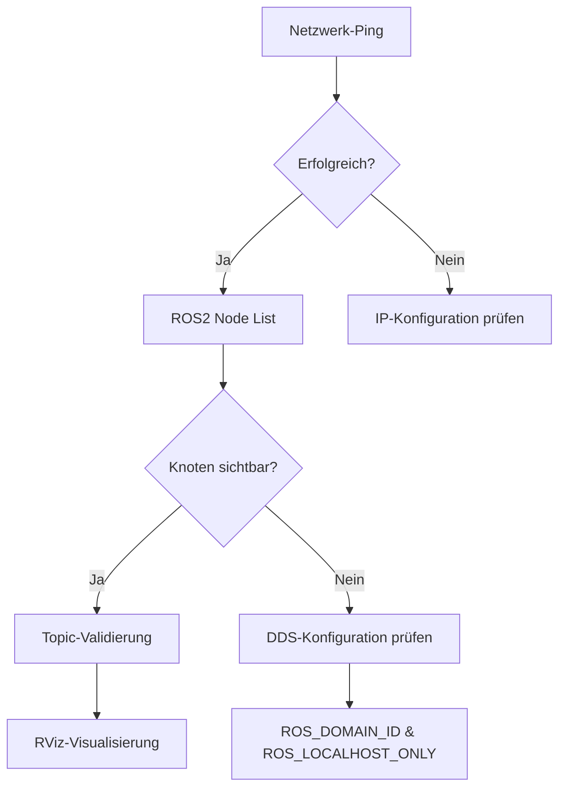

# TITA ROS2-Ökosystem: Diagnose und Lösungsanalyse

## Zusammenfassung der Hauptprobleme

### Primäres Problem: ROS2-DDS-Middleware-Fehlkonfiguration
- **Kernursache**: Diskrepanz bei `ROS_DOMAIN_ID` und `ROS_LOCALHOST_ONLY` zwischen Roboter, Host-PC und Tower
- **Auswirkung**: Bildung isolierter ROS2-Netzwerke, die sich nicht gegenseitig entdecken können
- **Symptome**: 
  - Blockierter Mapping-Dienst
  - Vollständiger Ausfall der RViz-Visualisierung
  - Fehlende Sensordaten-Übertragung

### Sekundäre Faktoren
1. **Dokumentationslücke**: Mangel an zugänglicher englischsprachiger technischer Dokumentation
2. **Symptomatische Fehler**: Mapping und RViz-Probleme sind Folgeerscheinungen des Netzwerkproblems

## Systemarchitektur-Analyse

### Kernkomponenten
| Komponente | Beschreibung | Funktion |
|------------|--------------|----------|
| `tita-bringup.service` | systemd-Dienst | Startet automatisch die Kernfunktionalität beim Bootvorgang |
| `tita-ros2-*.deb` | Debian-Paket | Enthält alle ROS2-Knoten, Launch-Files und Konfigurationen |
| Tower Message Mode Launch | ROS2-Knoten | Treiber für Tower-Hardware-Kommunikation |
| Network Manager | System-Skript | Verwaltet Haupt-Netzwerkschnittstellen (WLAN) |
| Tower Network Manager | System-Skript | Verwaltet dedizierte Tower-Ethernet-Verbindung |

### Netzwerktopologie
```
Host-PC (Entwicklung) ←→ WLAN ←→ TITA-Roboter ←→ Ethernet ←→ Tower
```

## Lösungsplan (3-stufiger Ansatz)

### Phase 1: ROS2-Netzwerkkonfiguration standardisieren

#### Auf dem TITA-Roboter:
```bash
# SSH-Verbindung zum Roboter
ssh user@<robot_ip>

# systemd-Dienstdatei bearbeiten
sudo nano /lib/systemd/system/tita-bringup.service

# Im [Service]-Abschnitt ergänzen:
Environment="ROS_DOMAIN_ID=45"
Environment="ROS_LOCALHOST_ONLY=0"

# Dienst neu laden und starten
sudo systemctl daemon-reload
sudo systemctl restart tita-bringup.service
```

#### Auf dem Host-PC:
```bash
# .bashrc bearbeiten
nano ~/.bashrc

# Am Ende hinzufügen:
export ROS_DOMAIN_ID=45
export ROS_LOCALHOST_ONLY=0

# Konfiguration laden
source ~/.bashrc
```

### Phase 2: Netzwerkkonnektivität verifizieren

#### Diagnosetabelle
| Schicht | Test | Befehl | Erwartetes Ergebnis |
|---------|------|--------|-------------------|
| L3 (IP) | Ping-Test | `ping <robot_ip>` | Erfolgreiche Antworten |
| L4 (Ports) | Port-Scan | `nmap -sU -p 7400-7412 <robot_ip>` | Offene/gefilterte UDP-Ports |
| L7 (DDS) | Multicast | `ros2 multicast receive` | Eingehende Pakete sichtbar |
| L7 (ROS2) | Knotenerkennung | `ros2 node list` | Roboter-Knoten werden aufgelistet |
| L7 (ROS2) | Topic-Erkennung | `ros2 topic list` | Roboter-Topics werden aufgelistet |

### Phase 3: Datenpipeline-Validierung

#### Mapping-Dienst (SLAM)
```bash
# SLAM-Knoten-Abhängigkeiten prüfen
ros2 node info /<slam_node_name>

# Lidar-Daten validieren
ros2 topic echo /scan

# Transformationsdaten validieren
ros2 topic echo /tf

# Karte validieren
ros2 topic list | grep map
```

#### RViz-Visualisierung
```bash
# RViz mit korrekter Locale starten (LC_NUMERIC-Bug vermeiden)
export LC_NUMERIC="en_US.UTF-8"
rviz2
```

## RViz-Konfiguration & Troubleshooting

### Grundkonfiguration
1. **Fixed Frame**: `map` oder `odom` setzen
2. **Robot Model**: `/robot_description` Topic verwenden
3. **TF-Anzeige**: Vollständigen Transformationsbaum prüfen
4. **LaserScan**: Topic `/scan` mit korrekter QoS
5. **Camera**: QoS auf "Best Effort" setzen

### Häufige Probleme und Lösungen
| Problem | Ursache | Lösung |
|---------|---------|---------|
| Weißes/unsichtbares Robotermodell | LC_NUMERIC-Bug | `export LC_NUMERIC="en_US.UTF-8"` |
| Keine Kamerabilder | QoS-Inkompatibilität | QoS auf "Best Effort" ändern |
| Komprimierte Bilder | Nicht direkt anzeigbar | `image_transport republish` verwenden |

## Best Practices & Empfehlungen

### 1. Automatisierung
```bash
# setup_tita_env.sh erstellen
#!/bin/bash
export ROS_DOMAIN_ID=45
export ROS_LOCALHOST_ONLY=0
export LC_NUMERIC="en_US.UTF-8"
echo "TITA-Umgebung konfiguriert"
```

### 2. Dokumentation
- Eigenes System-Handbuch erstellen
- IP-Adressen, Domain-IDs und kritische Befehle dokumentieren
- Versionskontrolle für Konfigurationen verwenden

### 3. Monitoring
```bash
# Regelmäßige Systemdiagnose
ros2 doctor

# Netzwerkstatus prüfen
ros2 multicast receive --timeout 5

# Topic-Latenz überwachen
ros2 topic hz /scan
```

### 4. Firewall-Konfiguration
```bash
# DDS-Ports freigeben (falls notwendig)
sudo ufw allow 7400:7412/udp
```

## Kritische Erkenntnisse

### Technische Insights
1. **DDS-Middleware**: Ping-Erfolg garantiert keine ROS2-Kommunikation
2. **systemd-Integration**: Umgebungsvariablen müssen in Service-Dateien gesetzt werden
3. **Multi-Homed-Netzwerk**: Roboter verwendet separate Schnittstellen für verschiedene Komponenten

### Diagnose-Workflow


## Fazit und Ausblick

Der Bericht zeigt eine systematische Herangehensweise zur Diagnose komplexer ROS2-Netzwerkprobleme. Die Lösung erfordert:

1. **Tiefes Verständnis** der DDS-Middleware-Architektur
2. **Systematische Diagnostik** auf allen Netzwerkschichten
3. **Persistente Konfiguration** über systemd-Services
4. **Proaktive Dokumentation** für zukünftige Wartung

Die vorgestellten Lösungsansätze sind nicht nur für TITA-Systeme relevant, sondern können als Referenz für Multi-Host-ROS2-Deployments generell dienen.